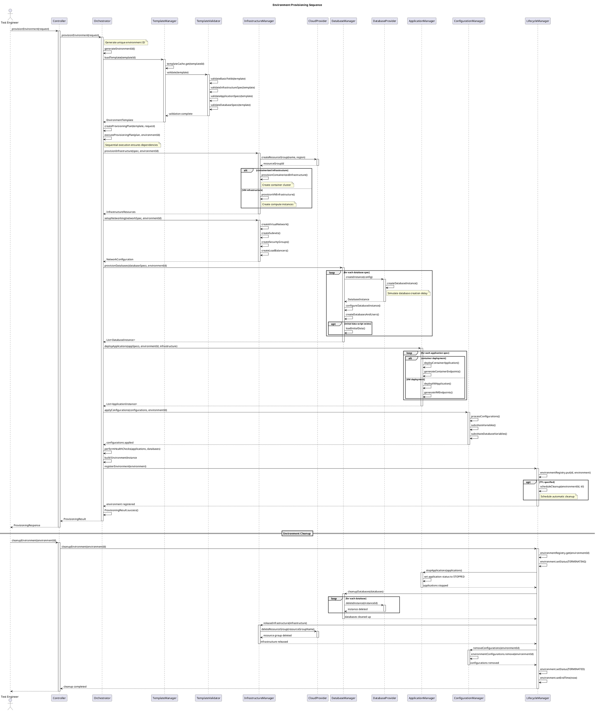

# SD Environment Provisioning Workspace

## Overview

This workspace implements a comprehensive **Test Environment Provisioning System** that can dynamically create, configure, and manage isolated test environments on-demand. The system supports multiple application stacks, database configurations, and infrastructure requirements while ensuring cost efficiency and rapid deployment.

## 🎯 System Design Goals

### Functional Requirements
- **On-Demand Provisioning**: Create test environments within minutes
- **Multi-Stack Support**: Support various application architectures (microservices, monoliths)
- **Database Management**: Provision and configure multiple database types
- **Environment Isolation**: Ensure complete isolation between test environments
- **Configuration Management**: Handle environment-specific configurations
- **Lifecycle Management**: Automatic environment cleanup and resource management
- **Template System**: Reusable environment templates for different test scenarios

### Non-Functional Requirements
- **Speed**: Environment provisioning within 5 minutes
- **Scalability**: Support 100+ concurrent environments
- **Cost Efficiency**: Automatic resource optimization and cleanup
- **Reliability**: 99.9% successful environment provisioning

## 🏗️ Architecture Overview

The system follows a **layered architecture** with clear separation of concerns:

```
┌─────────────────────────────────────────────────────────────────────────────────┐
│                    Test Environment Provisioning System                        │
├─────────────────────────────────────────────────────────────────────────────────┤
│  ┌─────────────────┐    ┌─────────────────┐    ┌─────────────────┐             │
│  │   API Layer     │    │   Orchestrator  │    │   Template      │             │
│  │  (Controller)   │    │                 │    │   Manager       │             │
│  └─────────────────┘    └─────────────────┘    └─────────────────┘             │
│           │                       │                       │                     │
│  ┌─────────────────────────────────────────────────────────────────────────────┐ │
│  │                        Manager Layer                                       │ │
│  │  ┌─────────────┐ ┌─────────────┐ ┌─────────────┐ ┌─────────────┐         │ │
│  │  │Infrastructure│ │   Database  │ │ Application │ │Configuration│         │ │
│  │  │   Manager   │ │   Manager   │ │   Manager   │ │   Manager   │         │ │
│  │  └─────────────┘ └─────────────┘ └─────────────┘ └─────────────┘         │ │
│  └─────────────────────────────────────────────────────────────────────────────┘ │
│           │                       │                       │                     │
│  ┌─────────────────┐    ┌─────────────────┐    ┌─────────────────┐             │
│  │   Cloud         │    │   Database      │    │   Model         │             │
│  │   Providers     │    │   Providers     │    │   Layer         │             │
│  └─────────────────┘    └─────────────────┘    └─────────────────┘             │
└─────────────────────────────────────────────────────────────────────────────────┘
```

## 🔧 Design Decisions & Justifications

### 1. **Orchestrator Pattern**
**Decision**: Use `EnvironmentProvisioningOrchestrator` as the main entry point for the core logic.

**Justification**: 
- Provides a single, unified API for complex provisioning workflows.
- Coordinates multiple managers and services, ensuring separation of concerns.
- Maintains transaction-like behavior with proper error handling and rollback.
- Simplifies client interaction by hiding internal complexity.

### 2. **Strategy Pattern for Providers**
**Decision**: Use `CloudProvider` and `DatabaseProvider` interfaces with multiple implementations.

**Justification**:
- Supports multiple cloud providers (AWS, Azure, GCP) and database types (PostgreSQL, MySQL) without changing core logic.
- Enables easy testing with mock implementations.
- Follows the Open/Closed Principle - open for extension, closed for modification.

### 3. **Template-Based Provisioning**
**Decision**: Use `EnvironmentTemplate` to define reusable environment configurations.

**Justification**:
- Promotes reusability and consistency across different test scenarios.
- Enables version control of environment definitions.
- Allows for centralized template validation and governance.

### 4. **Sequential Provisioning with Dependencies**
**Decision**: Execute provisioning steps in a specific order (Infrastructure → Network → Databases → Applications).

**Justification**:
- Ensures dependencies are met (e.g., applications need databases, which need a network).
- Provides predictable provisioning behavior and simplifies troubleshooting.
- Enables proper error handling and rollback at each distinct step.

### 5. **Lifecycle Management with TTL**
**Decision**: Implement automatic cleanup with Time-To-Live (TTL) support using a `ScheduledExecutorService`.

**Justification**:
- Prevents resource waste and minimizes cloud costs.
- Ensures test environments do not run indefinitely.
- Provides both manual (API-driven) and automatic (TTL-based) cleanup options.

## 📦 Core Components

### 1. **API Layer (`EnvironmentProvisioningController`)**
- **Purpose**: Provides an external entry point for managing environments. In a real-world application, this would be a REST API.
- **Key Features**:
  - Exposes endpoints for provisioning, status checks, and cleanup.
  - Decouples the core logic from the external interface.
  - Uses DTOs (`ProvisioningRequest`, `ProvisioningResponse`) for clean data contracts.

### 2. **Core (`EnvironmentProvisioningOrchestrator`)**
- **Purpose**: Main coordinator for the entire environment provisioning workflow.
- **Key Features**:
  - Executes the end-to-end provisioning sequence.
  - Integrates all managers to fulfill a provisioning request.
  - Implements top-level error handling and rollback on failure.

### 3. **Service Layer (`TemplateManager`, `TemplateValidator`)**
- **Purpose**: Manages the definition, validation, and retrieval of environment templates.
- **Key Features**:
  - Caches templates for performance.
  - Validates templates against a set of rules to ensure correctness.
  - Initializes sample templates for demonstration.

### 4. **Manager Layer**
- **`InfrastructureManager`**: Manages cloud infrastructure (resource groups, container clusters, VMs) using `CloudProvider` strategies.
- **`DatabaseManager`**: Manages database provisioning (instances, users, schemas) using `DatabaseProvider` strategies.
- **`ApplicationDeploymentManager`**: Manages application deployment for both containerized and VM-based applications.
- **`ConfigurationManager`**: Handles environment-specific configurations and dynamic variable substitution (e.g., for database connection strings).
- **`LifecycleManager`**: Manages the state of all environments, including TTL-based and manual cleanup operations.

## 🔍 Architecture Diagrams

The following diagrams illustrate the static structure and dynamic behavior of the system.

### Class Diagram

The class diagram shows the key classes, their relationships, and the overall layered architecture.

```plantuml
@startuml Environment Provisioning Class Diagram

!define RECTANGLE class

package "API Layer" {
    class EnvironmentProvisioningController {
        -provisioningOrchestrator: EnvironmentProvisioningOrchestrator
        -lifecycleManager: LifecycleManager
        +provisionEnvironment(request: ProvisioningRequest): ProvisioningResponse
        +getEnvironmentStatus(environmentId: String): EnvironmentStatus
        +cleanupEnvironment(environmentId: String): void
    }

    package "DTO" {
        class ProvisioningResponse {
            -environmentId: String
            -status: EnvironmentStatus
            -endpoints: Map<String, String>
            -estimatedReadyTime: Duration
        }
    }
}

package "Core" {
    class EnvironmentProvisioningOrchestrator {
        -templateManager: TemplateManager
        -infrastructureManager: InfrastructureManager
        -databaseManager: DatabaseManager
        -applicationManager: ApplicationDeploymentManager
        -configurationManager: ConfigurationManager
        -lifecycleManager: LifecycleManager
        +provisionEnvironment(request: ProvisioningRequest): ProvisioningResult
        -executeProvisioningPlan(plan: ProvisioningPlan, environmentId: String): EnvironmentInstance
        -createProvisioningPlan(template: EnvironmentTemplate, request: ProvisioningRequest): ProvisioningPlan
        -performHealthChecks(applications: List<ApplicationInstance>, databases: List<DatabaseInstance>): void
        -cleanupFailedProvisioning(environmentId: String): void
        -generateEnvironmentId(): String
    }
}

package "Service Layer" {
    class TemplateManager {
        -templateCache: Map<String, EnvironmentTemplate>
        -templateValidator: TemplateValidator
        +loadTemplate(templateId: String): EnvironmentTemplate
        +registerTemplate(template: EnvironmentTemplate): void
        +initializeSampleTemplates(): void
        -createMicroservicesTemplate(): EnvironmentTemplate
        -createWebAppTemplate(): EnvironmentTemplate
    }

    class TemplateValidator {
        +validate(template: EnvironmentTemplate): void
        -validateBasicFields(template: EnvironmentTemplate): void
        -validateInfrastructureSpec(template: EnvironmentTemplate): void
        -validateApplicationSpecs(template: EnvironmentTemplate): void
        -validateDatabaseSpecs(template: EnvironmentTemplate): void
    }
}

package "Manager Layer" {
    class InfrastructureManager {
        -cloudProviders: Map<String, CloudProvider>
        +provisionInfrastructure(spec: InfrastructureSpec, environmentId: String): InfrastructureResources
        +setupNetworking(spec: NetworkSpec, environmentId: String): NetworkConfiguration
        -getCloudProvider(providerName: String): CloudProvider
        -createResourceGroup(environmentId: String, provider: CloudProvider): String
        -provisionContainerizedInfrastructure(spec: InfrastructureSpec, resourceGroup: String, provider: CloudProvider): InfrastructureResources
        -provisionVMInfrastructure(spec: InfrastructureSpec, resourceGroup: String, provider: CloudProvider): InfrastructureResources
    }

    class DatabaseManager {
        -databaseProviders: Map<String, DatabaseProvider>
        +provisionDatabases(specs: List<DatabaseSpec>, environmentId: String): List<DatabaseInstance>
        -provisionDatabase(spec: DatabaseSpec, environmentId: String): DatabaseInstance
        -getDatabaseProvider(databaseType: String): DatabaseProvider
        -createDatabaseInstance(spec: DatabaseSpec, environmentId: String): DatabaseInstance
        -configureDatabaseInstance(instance: DatabaseInstance, spec: DatabaseSpec): void
        -createDatabasesAndUsers(instance: DatabaseInstance, databases: List<DatabaseConfig>): void
    }

    class ApplicationDeploymentManager {
        +deployApplications(specs: List<ApplicationSpec>, environmentId: String, infrastructure: InfrastructureResources): List<ApplicationInstance>
        -deployApplication(spec: ApplicationSpec, environmentId: String, infrastructure: InfrastructureResources): ApplicationInstance
        -deployContainerApplication(spec: ApplicationSpec, infrastructure: InfrastructureResources): ApplicationInstance
        -deployVMApplication(spec: ApplicationSpec, infrastructure: InfrastructureResources): ApplicationInstance
        -generateContainerEndpoints(spec: ApplicationSpec, cluster: ContainerCluster): List<String>
        -generateVMEndpoints(spec: ApplicationSpec, instances: List<ComputeInstance>): List<String>
        +performHealthChecks(applications: List<ApplicationInstance>): void
    }

    class ConfigurationManager {
        -environmentConfigurations: Map<String, Map<String, Object>>
        +applyConfigurations(configurations: Map<String, Object>, environmentId: String): void
        +getConfigurations(environmentId: String): Map<String, Object>
        -processConfigurations(configurations: Map<String, Object>, environmentId: String): Map<String, Object>
        -substituteVariables(value: String, environmentId: String): String
        -substituteDatabaseVariables(value: String, environmentId: String): String
        +removeConfigurations(environmentId: String): void
    }

    class LifecycleManager {
        -environmentRegistry: Map<String, EnvironmentInstance>
        -scheduler: ScheduledExecutorService
        -infrastructureManager: InfrastructureManager
        -databaseManager: DatabaseManager
        -applicationManager: ApplicationDeploymentManager
        -configurationManager: ConfigurationManager
        +registerEnvironment(environment: EnvironmentInstance): void
        +cleanupEnvironment(environmentId: String): void
        +getEnvironmentStatus(environmentId: String): EnvironmentStatus
        +getEnvironment(environmentId: String): EnvironmentInstance
        +startPeriodicCleanup(): void
        +shutdown(): void
        -scheduleCleanup(environmentId: String, ttlMillis: long): void
        -cleanupExpiredEnvironments(): void
        -stopApplications(applications: List<ApplicationInstance>): void
        -cleanupDatabases(databases: List<DatabaseInstance>): void
        -releaseInfrastructure(infrastructure: InfrastructureResources): void
    }
}

package "Provider Interfaces" {
    interface CloudProvider {
        +getProviderName(): String
        +createResourceGroup(name: String, region: String): String
        +deleteResourceGroup(resourceGroupName: String): void
        +isAvailable(): boolean
    }

    interface DatabaseProvider {
        +getDatabaseType(): String
        +createInstance(config: DatabaseInstanceConfig): DatabaseInstance
        +deleteInstance(instanceId: String): void
        +isAvailable(): boolean
    }
}

package "Model Layer" {
    class EnvironmentInstance << (D,orchid) >>
    class EnvironmentTemplate << (D,orchid) >>
    class ProvisioningRequest << (D,orchid) >>
    class ProvisioningResult << (D,orchid) >>
    class InfrastructureSpec << (D,orchid) >>
    class DatabaseSpec << (D,orchid) >>
    class ApplicationSpec << (D,orchid) >>
    enum EnvironmentStatus
    enum DeploymentType
}

package "Exception Layer" {
    class ProvisioningException
    class TemplateNotFoundException
    class TemplateValidationException
    class EnvironmentCleanupException
}

' Relationships
EnvironmentProvisioningController --> EnvironmentProvisioningOrchestrator
EnvironmentProvisioningController --> LifecycleManager
EnvironmentProvisioningController ..> ProvisioningRequest
EnvironmentProvisioningController ..> ProvisioningResponse

EnvironmentProvisioningOrchestrator --> TemplateManager
EnvironmentProvisioningOrchestrator --> InfrastructureManager
EnvironmentProvisioningOrchestrator --> DatabaseManager
EnvironmentProvisioningOrchestrator --> ApplicationDeploymentManager
EnvironmentProvisioningOrchestrator --> ConfigurationManager
EnvironmentProvisioningOrchestrator --> LifecycleManager

TemplateManager --> TemplateValidator
TemplateManager --> EnvironmentTemplate

InfrastructureManager --> CloudProvider
DatabaseManager --> DatabaseProvider

LifecycleManager --> InfrastructureManager
LifecycleManager --> DatabaseManager
LifecycleManager --> ApplicationDeploymentManager
LifecycleManager --> ConfigurationManager

EnvironmentProvisioningOrchestrator ..> ProvisioningRequest
EnvironmentProvisioningOrchestrator ..> ProvisioningResult
EnvironmentProvisioningOrchestrator ..> EnvironmentInstance

TemplateNotFoundException --|> ProvisioningException
TemplateValidationException --|> ProvisioningException
EnvironmentCleanupException --|> ProvisioningException

@enduml
```



### Sequence Diagram

The sequence diagram details the step-by-step flow for both provisioning and cleaning up an environment, showing how the different components interact.



## 🚀 Getting Started

### Prerequisites
- Java 11 or higher
- Maven 3.6+
- IDE with Java support (IntelliJ IDEA, Eclipse, VS Code)

### Quick Start

1. **Clone and navigate to the workspace**:
   ```bash
   cd sd-environmentprovisioning-workspace
   ```

2. **Compile the project**:
   ```bash
   mvn clean compile
   ```

3. **Run the tests**:
   ```bash
   mvn test
   ```

4. **View test results**:
   Check `target/surefire-reports/` for detailed test reports.

## 🧪 Test Coverage

The project includes a comprehensive test suite that validates the functionality from multiple perspectives.

### Unit Tests (`EnvironmentProvisioningTest`)
- **Focus**: Individual components in isolation.
- **Mocks**: Uses mock providers (`MockCloudProvider`, `MockDatabaseProvider`) for fast and predictable tests.
- **Scenarios**:
  - Successful provisioning of different template types.
  - Graceful failure on invalid template requests.
  - Basic lifecycle management (registration and manual cleanup).

### Integration Tests (`EnvironmentProvisioningIntegrationTest`)
- **Focus**: End-to-end workflows and component interactions.
- **Mocks**: Uses "realistic" mock providers that simulate network delays.
- **Scenarios**:
  - Complete environment lifecycle from provisioning to cleanup.
  - Performance testing of concurrent provisioning requests.
  - Verification of resource isolation between environments.
  - TTL-based automatic cleanup validation.

## 🎓 Learning Outcomes

This workspace demonstrates:

### System Design Skills
- **Layered & Microservices-style Architecture**: Loosely coupled, highly cohesive components.
- **Scalable Design**: Support for concurrent operations and horizontal scaling via provider model.
- **Provider Abstraction**: Multi-cloud and multi-database support through strategy pattern.
- **Lifecycle Management**: Automated resource management and cost control.

### Java Programming Skills
- **Advanced OOP**: Interfaces, inheritance, polymorphism, encapsulation.
- **Concurrency**: Thread-safe programming with `ConcurrentHashMap` and `ScheduledExecutorService`.
- **Design Patterns**: Practical application of Orchestrator, Strategy, and Builder patterns.
- **Modern Java**: Use of `Lombok`, Streams, `CompletableFuture`, and `Duration`.

### Testing Skills
- **Unit & Integration Testing**: Clear separation of test types using TestNG.
- **Mocking**: Use of mock objects for isolated unit tests and realistic mocks for integration tests.
- **Concurrency Testing**: Validating system behavior under concurrent load.
- **Test Design**: Comprehensive scenario coverage from happy paths to error conditions.